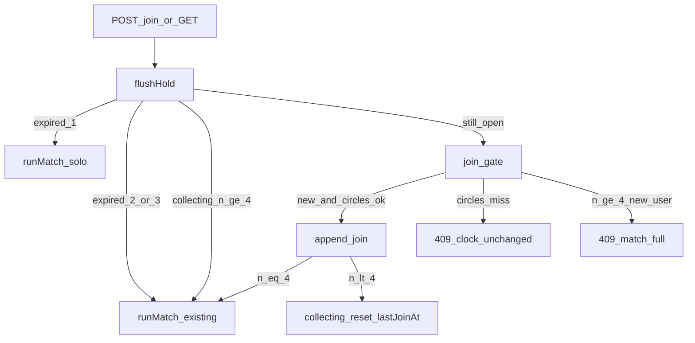

# Hold Then Settle Implementation Plan

> 註解與非程式說明用繁體中文（ASD-STE100）；識別名與 API 維持英文。乘客畫面文案全英文。

**Goal:** 現場同一團可收到 3／4 人；未滿 4 則 idle 15 秒後對當下人數結算；一人逾時改獨乘並可進 Pay。

**Architecture:** 時鐘與文案抽成純函式 [`web/src/engine/hold.ts`](../../../web/src/engine/hold.ts)。團檔加 `lastJoinAt`。[`web/server/matchStore.ts`](../../../web/server/matchStore.ts) 的 `addToCollecting` 不再對 2／3 人呼叫 `settle`；滿 4 才立刻 `runMatch`。`GET /api/match` 與每次 `join` 開頭先 `flushHold`（idle 到點或 collecting 已有 4 人則結算）。[`runMatch`](../../../web/src/engine/match.ts)、牆、車資、對白、OpenRouter 潤稿都不改。

**Tech Stack:** Vite 8、React 19、Vitest、既有 JSON 團檔 `storage/matches/current.json`。

## Global Constraints

- Rider-facing UI is English. 倒數不可列出池中是誰，也不可寫「you are rider N」。
- `HOLD_IDLE_MS = 15_000`。測試用 `nowMs` 注入，不要用真實 `sleep(15)`。
- 只有「新成員成功加入」才重設 `lastJoinAt`。同帳號再 join、以及 `walk_circles_miss`，都不重設。
- `flushHold` 必須在 join 新人前先跑：逾時後第 3 人開新團，不得救回已到期的 2 人團。
- 已成交後新帳號仍開新團。滿員仍是 409 `match_full`。
- 不要改 [`web/src/engine/match.ts`](../../../web/src/engine/match.ts) 的 `runMatch`／`hitsWall`／`splitBySolo`。一人結算沿用既有 `runMatch([1 人]) → status: 'solo'`。
- 不要 commit，除非使用者明確要求。
- 使用者規則：web UI 改完後用瀏覽器走一次主路徑。

## Locked rule

```text
同一團 collecting
  → 先 flushHold（idle 到期或人數 ≥ 4 → 對當下 joins 跑 runMatch）
  → 滿 4 人的那一次成功 join：立刻 runMatch，拒絕第 5 人
  → 1／2／3 人：寫 collecting，lastJoinAt = 此次成功加入的 now
  → idle 15s：1 人 → solo（可 Pay）；2／3 人 → 現有仲裁
  → 圈不合：409 walk_circles_miss，檔與 lastJoinAt 不變
```



---

## File map

- Create: [`web/src/engine/hold.ts`](../../../web/src/engine/hold.ts)、[`web/src/engine/hold.test.ts`](../../../web/src/engine/hold.test.ts)
- Modify: [`web/src/engine/match.ts`](../../../web/src/engine/match.ts) 只加 `MatchRecord.lastJoinAt`
- Modify: [`web/server/matchStore.ts`](../../../web/server/matchStore.ts)、[`web/vite.match-plugin.ts`](../../../web/vite.match-plugin.ts)
- Modify tests: [`web/server/matchStore.test.ts`](../../../web/server/matchStore.test.ts)、[`web/server/matchStore.full.test.ts`](../../../web/server/matchStore.full.test.ts)、以及所有手寫 `MatchRecord` 的 fixture（補 `lastJoinAt: null`）
- Modify UI: [`web/src/screens/NegotiateScreen.tsx`](../../../web/src/screens/NegotiateScreen.tsx)、[`web/src/index.css`](../../../web/src/index.css)（`.match-screen p` 已存在，通常不用新 class）
- Modify judge: [`web/src/engine/judgeTheater.ts`](../../../web/src/engine/judgeTheater.ts) 的 collecting sys 行加剩餘秒數
- Modify: [`AGENTS.md`](../../../AGENTS.md) 活配對那一條 workspace fact

不重寫 [`docs/superpowers/plans/2026-09-19-multi-window-match.md`](2026-09-19-multi-window-match.md)。該檔「2–4 人立刻 runMatch」由本計畫取代。

---

### Task 1: hold 純函式

**Files:** Create `web/src/engine/hold.ts`、`web/src/engine/hold.test.ts`

**Produces:**
- `HOLD_IDLE_MS = 15_000`
- `holdExpired(joinCount, lastJoinAt, nowMs): boolean`
- `holdRemainingMs(joinCount, lastJoinAt, nowMs): number`
- `holdWaitCopy(joinCount, remainingSec): string`

規則：
- `joinCount <= 0` → 不到期，remaining 0
- `joinCount >= 4` → 立刻到期（給 flush 用）
- `1..3` 且 `lastJoinAt` 為 null → 不到期（migrate 會補時間）
- `1..3`：`nowMs - Date.parse(lastJoinAt) >= HOLD_IDLE_MS` 才到期
- remaining 下限 0；`joinCount >= 4` 時 remaining 0
- 文案：`joinCount <= 1` → `Solo taxi in ${n}s if no one joins.`；否則 → `Match starts in ${n}s if no one else joins.`

- [x] 先寫 `hold.test.ts`（不到期 14999、到期 15000、4 人立刻、null 不到期、文案兩句）
- [x] `cd web && npx vitest run src/engine/hold.test.ts` 必須失敗
- [x] 寫 `hold.ts` 使測試通過

---

### Task 2: 團檔欄位 `lastJoinAt`

**Files:** Modify [`web/src/engine/match.ts`](../../../web/src/engine/match.ts) 的 `MatchRecord`；[`web/server/matchStore.ts`](../../../web/server/matchStore.ts) 的 `emptyMatch`／`collectingRecord`／`migrateMatch`

```ts
export type MatchRecord = {
  id: string
  status: MatchStatus
  adopted: 'v1' | 'v2' | 'solo'
  joins: MatchJoinBody[]
  riders: MatchRider[]
  sharePlan: ShareRoutePlan | null
  lastJoinAt: string | null
}
```

- `emptyMatch`：`lastJoinAt: null`（無檔仍不寫磁碟）
- `collectingRecord(joins, lastJoinAt)`：寫入 ISO 字串
- `runMatch` 回傳值：補 `lastJoinAt: null`（成交後不再等人；函式本體邏輯不改，只補欄位以免型別破）
- migrate：collecting 且有 joins 且缺 `lastJoinAt` → 填 `new Date().toISOString()`，避免舊檔被第一次 GET 立刻獨乘
- 所有手寫 `MatchRecord` 的測試／helper 加 `lastJoinAt: null`

- [x] `cd web && npx vitest run` 必須再綠（僅型別／fixture，行為未變）

---

### Task 3: join 改成先收、滿 4 才立刻成交

**Files:** Modify [`web/server/matchStore.ts`](../../../web/server/matchStore.ts)、[`web/server/matchStore.test.ts`](../../../web/server/matchStore.test.ts)

`JoinMatchOptions` 加 `nowMs?: number`，預設 `Date.now()`。

`addToCollecting` 新語意：
- 圈不合 → 仍丟 `walk_circles_miss`，**不寫檔**（`lastJoinAt` 不變）
- 新成員且 `joins.length < 4` → `collectingRecord(joins, new Date(nowMs).toISOString())`
- 新成員且 `joins.length === 4` → `settle(...)`
- 同帳號已在 collecting：更新該筆 join 內容，**不**改 `lastJoinAt`

- [x] 先改測試使舊「2 人立刻成交」失敗、新「2／3 人 collecting、4 人成交」紅
- [x] 改 `addToCollecting` 使測試綠
- [x] `cd web && npx vitest run server/matchStore.test.ts`

---

### Task 4: flushHold（GET 與 join 開頭）

**Files:** Modify [`web/server/matchStore.ts`](../../../web/server/matchStore.ts)、[`web/vite.match-plugin.ts`](../../../web/vite.match-plugin.ts)、[`web/server/matchStore.test.ts`](../../../web/server/matchStore.test.ts)、[`web/server/matchStore.full.test.ts`](../../../web/server/matchStore.full.test.ts)

```ts
export async function flushHold(
  filePath: string,
  options: JoinMatchOptions = {},
): Promise<MatchRecord>
```

- 讀檔。非 collecting 或 `joins.length === 0` → 原樣回
- `holdExpired(joins.length, lastJoinAt, nowMs)` 為真 → `settle(filePath, joins, options)`（1 人走既有 solo；2／3／4 走既有仲裁）
- 已是 settled／solo → 不要重跑

`joinMatch` **第一件事**（在 `alreadyIn`／`match_full` 之前）：`const current = await flushHold(...)`。

`GET /api/match`：`sendJson(res, 200, await flushHold(matchFile, { apiKey }))`。

- [x] 先寫上述測試（紅）
- [x] 實作 `flushHold` 並接到 join／GET
- [x] `cd web && npx vitest run server/matchStore.test.ts server/matchStore.full.test.ts`

---

### Task 5: 等待畫面倒數

**Files:** Modify [`web/src/screens/NegotiateScreen.tsx`](../../../web/src/screens/NegotiateScreen.tsx)

仍 `Waiting for nearby riders`。其下一個 `<p aria-live="polite">` 顯示 `holdWaitCopy(joins.length, ceil(remainingMs/1000))`。

- 本機每 250–1000ms 重算 remaining（只更新字，不在瀏覽器結算）
- 既有 `MATCH_POLL_MS`（800）繼續 `fetchMatch` → 伺服器 `flushHold`
- `collecting` 時 Skip 仍 disabled；`solo`／`settled` 後走既有對白 → Pay
- 不要顯示其他乘客名字或人數徽章

- [x] 改 NegotiateScreen
- [x] `cd web && npx vitest run src/engine/hold.test.ts src/engine/matchView.test.ts`

---

### Task 6: 評審房 collecting 行

**Files:** Modify [`web/src/engine/judgeTheater.ts`](../../../web/src/engine/judgeTheater.ts)、[`web/src/engine/judgeTheater.test.ts`](../../../web/src/engine/judgeTheater.test.ts)

collecting 的 sys 行維持 `Waiting for nearby riders.` 與 `In the room: ...`。其後加 ` Hold ${remaining}s.`（用 `holdRemainingMs`；測試固定 `lastJoinAt` + `now`）。評審房本來就列出在房的人，這不違反乘客 UI 規則。

- [x] 改測試與實作
- [x] `cd web && npx vitest run src/engine/judgeTheater.test.ts`

---

### Task 7: 全測、文件、瀏覽器

- [x] `cd web && npx vitest run` 全綠
- [x] 更新 [`AGENTS.md`](../../../AGENTS.md) Learned Workspace Facts
- [x] 把本計畫寫入本檔
- [x] 瀏覽器（先 `POST /api/match/reset`）：
  1. 只登 Yu → Match → 等 15s → 對白／Solo taxi → 可進 Pay
  2. reset；Yu 再 Lin（15s 內）→ Yu 畫面改配對倒數 → 再等 15s → 兩人同一團成交
  3. reset；Yu／Lin／Chiang／Yang 在 15s 內依序加入 → 第 4 人進來立刻 4 人成交
  4. 圈不合回 409 `walk_circles_miss`，Yu 的 `lastJoinAt` 與倒數不重來

---

## 不做

- 不改 Extra time、Max walk、跳表、v1／v2、牆、OpenRouter prompt
- 不做「等滿 3／4 才開跑」的第二套策略
- 不把 15 秒做成使用者可調滑桿
- 不在客戶端結算（避免分頁關了就永遠 collecting）
